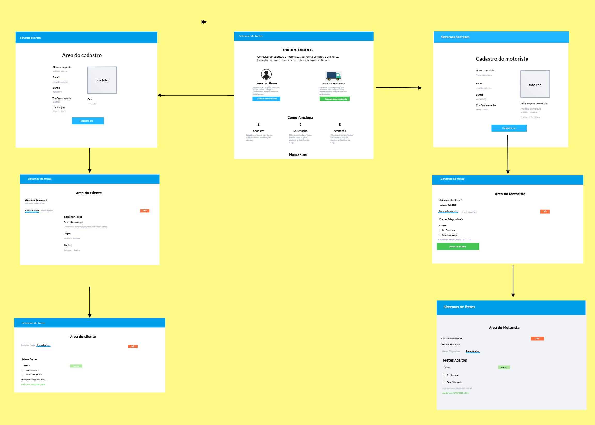
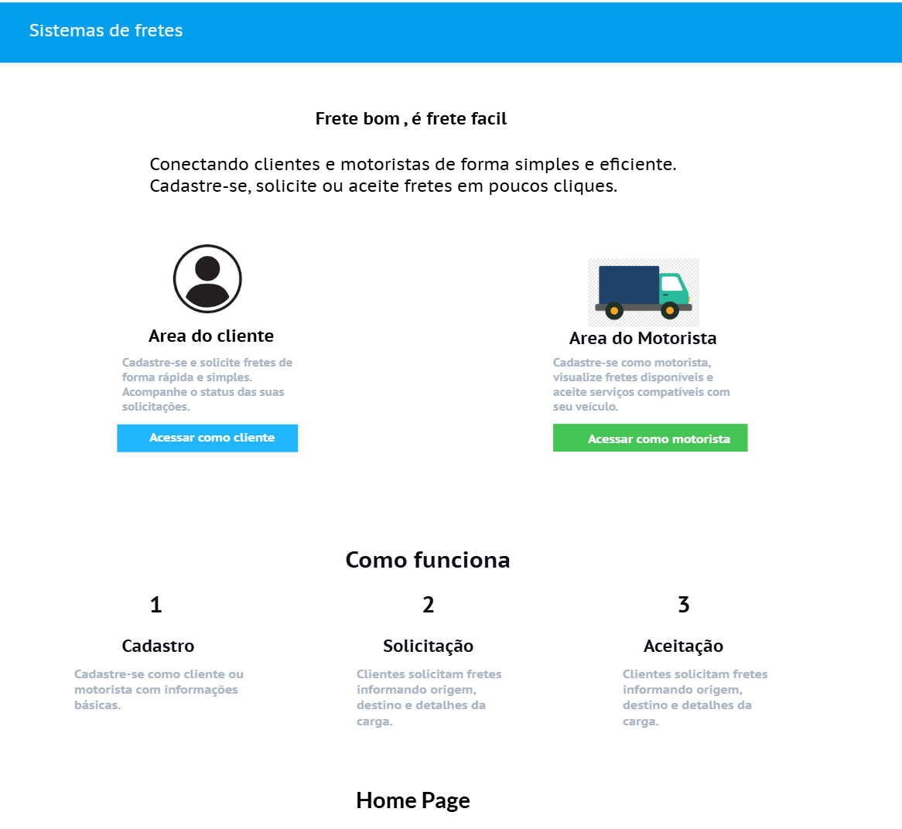
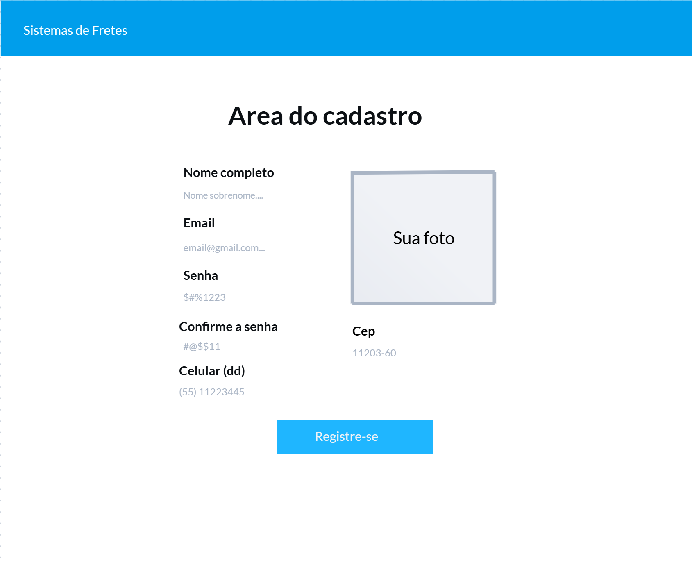
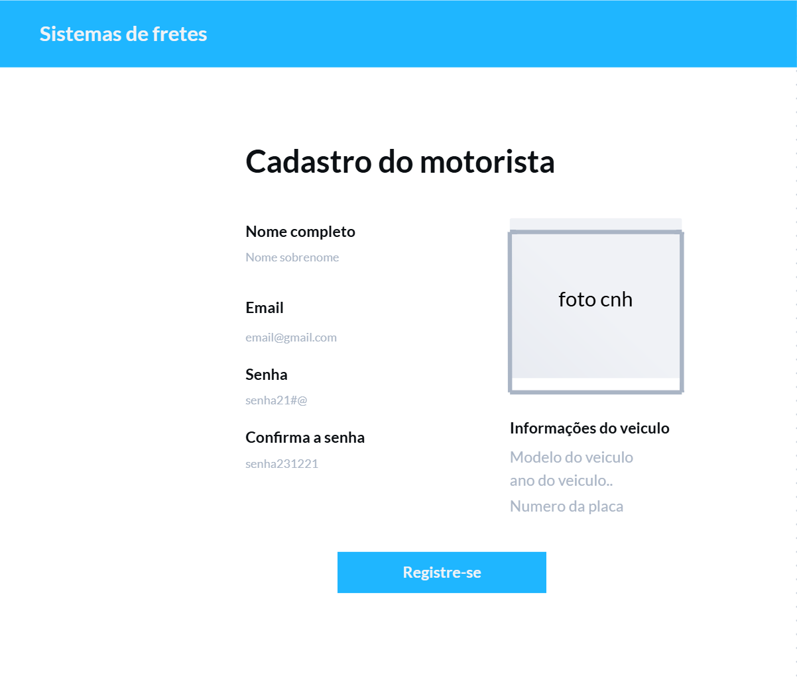
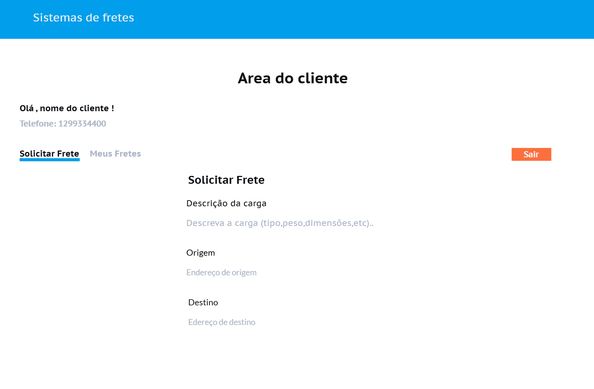
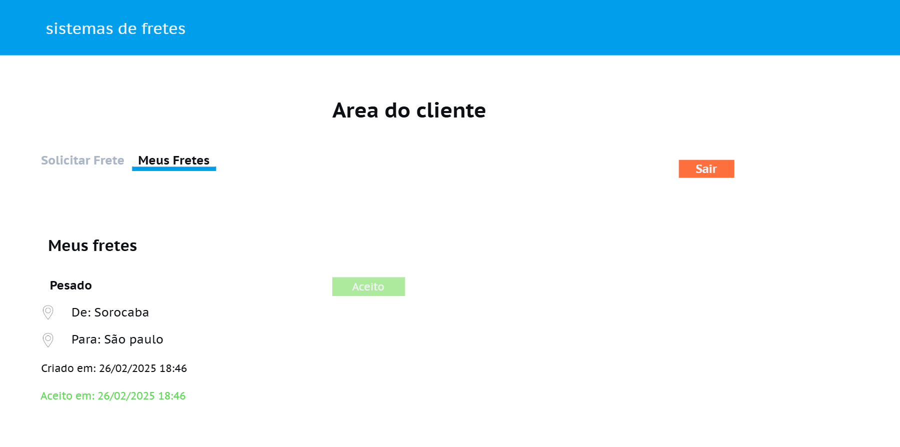
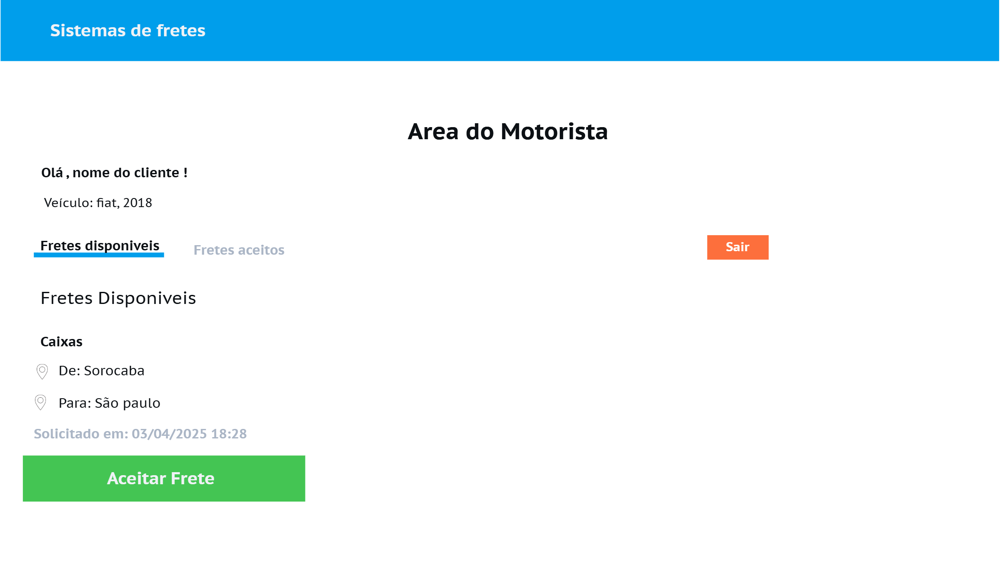
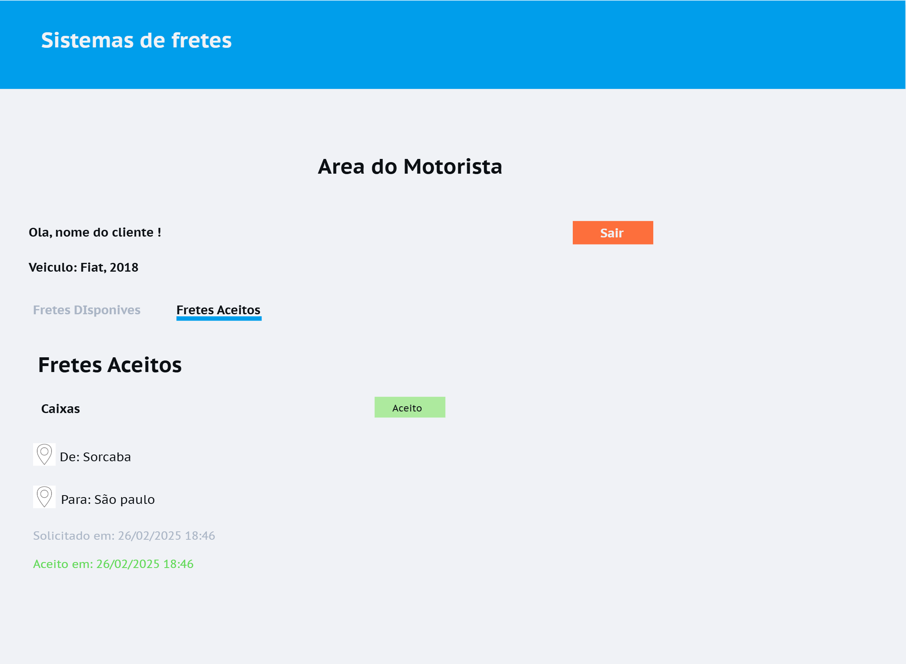

# Projeto de Interface

## User Flow
O fluxograma apresentado na figura 1 mostra o fluxo de interação do usuário pelas telas do sistema. Cada uma das telas deste fluxo é detalhada na seção de Protótipo de baixa fidelidade que se segue. Para visualizar o protótipo interativo, acesse o ambiente [MarvelApp](https://marvelapp.com/whiteboard/cx7C8ckm1cUnLtUSFXgo) do projeto.

  
Figura 1 - Fluxo de telas do usuário

## Protótipo de baixa fidelidade
As telas do sistema apresentam uma estrutura comum entre elas, que é apresentada na figura 2. Nesta estrutura existem 2 grandes blocos, descritos a seguir. São eles:
<ul>
<li>Cabeçalho - local onde estão dispostos o nome da aplicação web e navegação principal do site (menu da aplicação);</li>
<li>Conteúdo - apresenta o conteúdo da tela em questão;</li>
</ul>

  
Figura 2 - Estrutura padrão do site

---

### Tela de Home Page
**Descrição:** Tela inicial apresentando opções para acessar como cliente ou motorista, e explicação do funcionamento do sistema.

  
Figura 3 - Tela de Home Page

---

### Tela de Cadastro de Cliente
**Descrição:** Cadastro de cliente com campos para nome completo, email, senha, confirmação de senha, celular, CEP e foto.

  
Figura 4 - Tela de Cadastro de Cliente

---

### Tela de Cadastro de Motorista
**Descrição:** Cadastro de motoristas com dados pessoais, upload de foto da CNH e informações do veículo (modelo, ano e placa).

  
Figura 5 - Tela de Cadastro de Motorista

---

### Tela de Área do Cliente - Solicitar Frete
**Descrição:** Tela para que clientes solicitem fretes, preenchendo a descrição da carga, origem e destino.

  
Figura 6 - Tela de Área do Cliente - Solicitar Frete

---

### Tela de Área do Cliente - Meus Fretes
**Descrição:** Tela para que clientes acompanhem os fretes solicitados e aceitos, mostrando a origem, destino e datas.

  
Figura 7 - Tela de Área do Cliente - Meus Fretes

---

### Tela de Área do Motorista - Fretes Disponíveis
**Descrição:** Tela para motoristas visualizarem fretes disponíveis para aceitar, com detalhes do trajeto e carga.

  
Figura 8 - Tela de Área do Motorista - Fretes Disponíveis

---

### Tela de Área do Motorista - Fretes Aceitos
**Descrição:** Tela onde motoristas acompanham os fretes aceitos, visualizando origem, destino e status de aceitação.

  
Figura 9 - Tela de Área do Motorista - Fretes Aceitos
